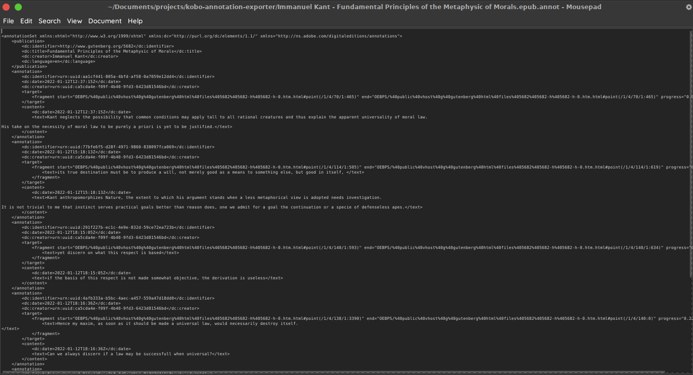
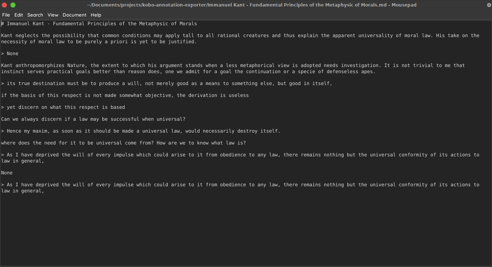

# Kobo e-reader Annotation Exporter

As far as I am aware, there are no options out there for exporting the annotations you make with Kobo e-readers into neat and readable files. This script finds all annotation files stored in the e-reader recursively and converts them into markdown files.

This script was developed with the Kobo Clara HD model.




## Requirement

- Python 3.6 and higher,
- modules html, os, pathlib, and sys should be included by default.

## Usage

Simply drop the script in your `.local/bin` directory and call it from the command line. Your Kobo e-reader must be plugged in order for the script work.

```bash
$ annot
No path was provided.
Default KOBOeReader path will be used.
Exporting Immanuel Kant - Fundamental Principles of the Metaphysic of Morals.md...
Exporting Chris Bailey - The Productivity Project.md...
```

The default script I used corresponds to where the Kobo Clara HD model stores it's .annot files. If your model has a different directory setup you may enter a custom path like this.

```bash
$ annot /media/user/KOBOeReader/Digital\ Editions/Annotations/
Exporting Immanuel Kant - Fundamental Principles of the Metaphysic of Morals.md...
Exporting Chris Bailey - The Productivity Project.md...
```

## Author
- Dr. Mounir Mallek
